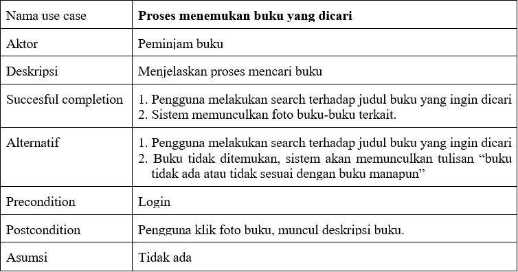
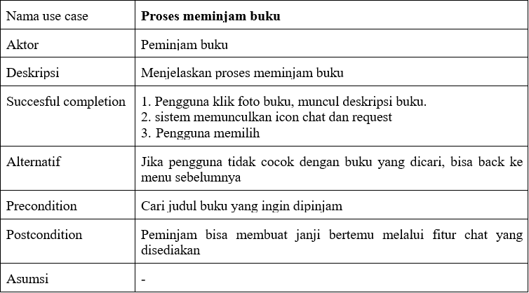
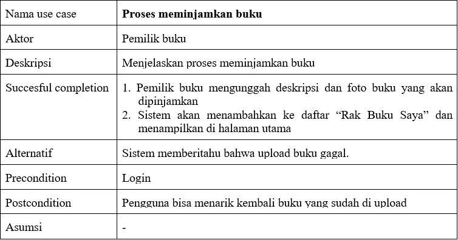
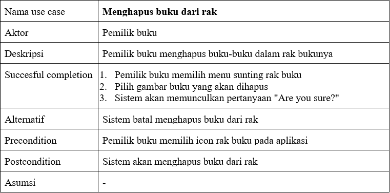

# BUKULAPUK

Aplikasi untuk pinjam dan meminjamkan buku bagi mahasiswa IPB.

## Group 3

1. Ilham Ghiffari Noorrrahmat (G64180012)
2. Elina Eprida (G64180038)
3. Alwi Miftahul Kharomi (G64180077)

## Latar belakang

Kebutuhan akan buku panduan pembelajaran sangat penting, namun masih banyak mahasiswa IPB yang tidak dapat memenuhi hal tersebut karena banyak faktor. Salah satunya yaitu faktor ekonomi. Dengan adanya aplikasi ini diharapkan mahasiswa yang memiliki buku suatu mata kuliah namun sudah tidak terpakai/digunakan dapat meminjamkan kepada mahasiswa lain. 

## Tujuan

1. Membantu mahasiswa dalam meminjam buku.
2. Membantu mahasiswa untuk memanfaatkan buku yang sudah tidak digunakan.
3. Membentuk relasi antar mahasiswa.

## Ruang lingkup
### Minimum requirement
| Operating System | Windows 7 atau diatasnya |
|--|--|
|Processor|2.0 Ghz Processor|
|Memory|2 GB minimum, 4 GB recommended|
|Screen Resolution|800x600 atau diatasnya|
|Internet Access|Diperlukan|

## Deskripsi perangkat lunak
Bukulapuk merupakan *software* berbasis web yang berfungsi untuk memudahkan mahasiswa IPB dalam berinteraksi terkait pinjam-meminjam buku sesama mahasiswa. Melalui *software* ini, pengguna dapat meminjam maupun meminjamkan buku. 

## Analisis user (user profile)

## User story 
* Sebagai seorang mahasiswa, saya ingin meminjam buku dengan mudah kepada sesama mahasiswa di IPB.
* Sebagai seorang mahasiswa, saya ingin meminjamkan buku dengan mudah kepada sesama mahasiswa di IPB.
## Use case diagram

## Use case description 

## Activity diagram

## Gantt chart

## ERD

## Hasil implementasi perangkat lunak
